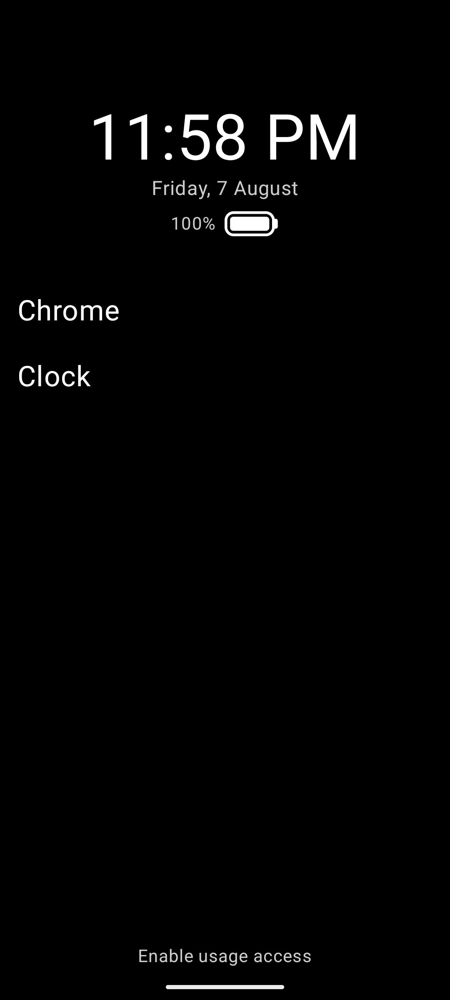
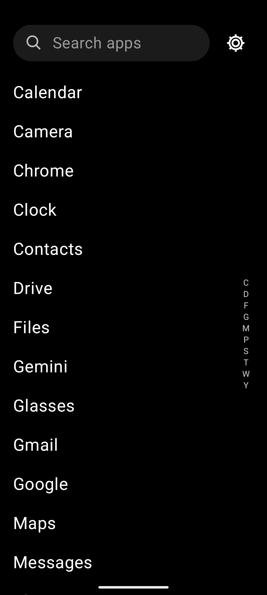
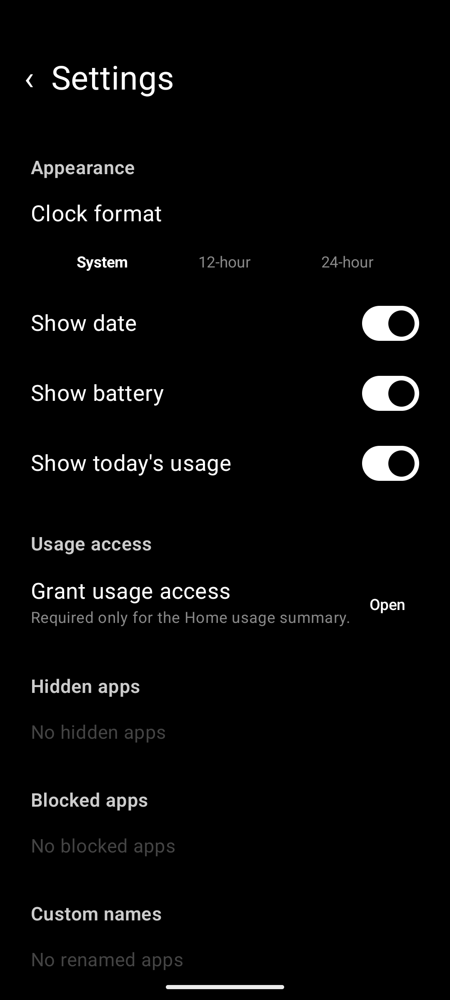

<h1 align="center">Minimal Launcher</h1>

<p align="center">
  <a href="https://www.linkedin.com/in/rafael-goulartb/">
    
  </a>
  <a href="https://rafaelgoulartb.github.io/minimal-launcher/">
    
  </a>
  <a href="https://github.com/RafaelGoulartB/minimal-launcher#readme">
    
  </a>
  <a href="https://github.com/RafaelGoulartB/minimal-launcher/graphs/commit-activity">
    
  </a>
  <a href="https://github.com/RafaelGoulartB/minimal-launcher/actions/workflows/release-android.yml">
    
  </a>
  
  
  
</p>

> A distraction-conscious Android home screen built with Kotlin and Jetpack Compose.

Minimal Launcher replaces the usual icon grid with a calm, text-first interface. Favorite apps and folders stay on Home, while the complete searchable app list is always one swipe away.

The app keeps launcher preferences on the device, requires no account, and declares no internet permission, analytics, or background service.

## Screenshots

<p align="center">
  
  
  
</p>

## Features

### Focused Home

- Keep selected apps and folders on a simple text-first Home screen.
- Reorder Home items with long-press and drag.
- Expand folders inline without leaving Home.
- Show a configurable clock, date, battery percentage, and today's usage summary.
- Choose system, serif, or monospace type; small, medium, or large text; and five accent colors.

### Fast app drawer

- Swipe left from Home to open the complete app list.
- Search installed apps with optional automatic keyboard focus.
- Scrub the animated alphabet rail to jump directly to a section.
- Expand folders inline alongside the main app list.
- Return to the top quickly after scrolling through a long catalog.
- Refresh the list automatically when an app is installed or removed.

### Apps and folders

- Add or remove apps and folders from Home.
- Rename apps and folders without changing their system names.
- Create folders and move apps between them.
- Hide apps from the drawer and restore them later from Settings.
- Block apps inside Minimal Launcher without an accessibility service.
- Open Android app info or the system uninstall confirmation from the management menu.

### Privacy

- Store launcher preferences locally with Android DataStore.
- Use the launcher without an account, cloud service, or internet permission.
- Keep Usage Access optional; it is used only to calculate today's foreground-app time on the device.
- Run without analytics, advertising SDKs, or a background service.

## Tech stack

- [Kotlin](https://kotlinlang.org/)
- [Jetpack Compose](https://developer.android.com/compose) with Material 3
- AndroidX Lifecycle and `ViewModel`
- Android DataStore Preferences
- JUnit 4, Kotlin Coroutines Test, and AndroidX Compose testing
- Gradle Kotlin DSL

The app uses a single activity and a state-driven Compose UI. Platform integrations and persistence live in `data/`; screens, appearance, events, and `LauncherViewModel` live in `ui/`.

## Getting started

### Requirements

- Android Studio with its bundled JDK, or JDK 17
- Android SDK 37
- Android 8.0 (API 26) or newer device or emulator
- ADB for installation and device-based tests

Check the local environment:

```sh
make doctor
```

Build a debug APK:

```sh
make debug
```

On Windows without Make, run:

```powershell
.\gradlew.bat :app:assembleDebug
```

The APK is generated at `app/build/outputs/apk/debug/app-debug.apk`.

Install and open the app on a selected device:

```sh
make run DEVICE=emulator-5554
```

Press the device's Home button and choose **Minimal Launcher**, or assign it from Android's default Home app settings. The Makefile can open that flow with:

```sh
make home DEVICE=emulator-5554
```

## Using the launcher

- Swipe left from Home to open all apps.
- Tap an app to launch it; long-press it for management actions.
- Long-press and drag Home items to reorder them.
- Tap a folder to expand its contents.
- Use search or the alphabet rail to navigate the app drawer.
- Open Settings from the app list to customize appearance and manage hidden, blocked, renamed, and grouped apps.

Blocking only affects launches from Minimal Launcher. Hidden and blocked apps remain installed and can be restored from Settings.

## Development

Run Android lint and local unit tests:

```sh
make check
```

Useful focused commands:

```sh
make lint        # Android lint only
make unit-test   # Local JVM tests only
make ui-test     # Compose tests on a connected device
make test        # Local and device tests
```

Build release artifacts with:

```sh
make release
make bundle
```

Run `make help` to list every available target. When more than one Android device is connected, pass its ADB serial through `DEVICE`.

## Releases and website

The Android release workflow runs when app or build-system changes reach `main`. It runs lint and unit tests, calculates the next patch version from Git tags, builds a signed APK, creates a SHA-256 checksum, and publishes both in a GitHub Release. Documentation and landing-page-only changes do not trigger an Android build.

Repository secrets required for signed releases:

- `ANDROID_KEYSTORE_BASE64`
- `ANDROID_KEYSTORE_PASSWORD`
- `ANDROID_KEY_ALIAS`
- `ANDROID_KEY_PASSWORD`

The landing page in [`www/`](www/) is deployed separately to GitHub Pages whenever its files change. The Pages workflow can also be started manually from the Actions tab.

## Project structure

```text
app/src/
├── main/
│   ├── java/com/rafael/minimallauncher/
│   │   ├── data/        Installed apps, DataStore preferences, and usage stats
│   │   └── ui/          Compose screens, state, appearance, and interactions
│   ├── res/             Android strings, theme, and launcher icon
│   └── AndroidManifest.xml
├── test/                Local JUnit tests
└── androidTest/         Device and Compose instrumentation tests
assets/screenshots/      README screenshots
www/                     Static GitHub Pages landing page
.github/workflows/       Android release and website deployment
```

## Contributing

Issues and pull requests are welcome. For larger changes, open an issue first so the approach can be discussed before implementation.

When submitting a change:

1. Keep the text-first experience and local-only architecture intact.
2. Put user-facing text in `res/values/strings.xml` when practical.
3. Add fast JVM coverage for pure logic and Compose tests for gestures, semantics, navigation, or state rendering.
4. Run `make check` before opening the pull request.
5. Include screenshots or a recording for user-visible Compose changes.
