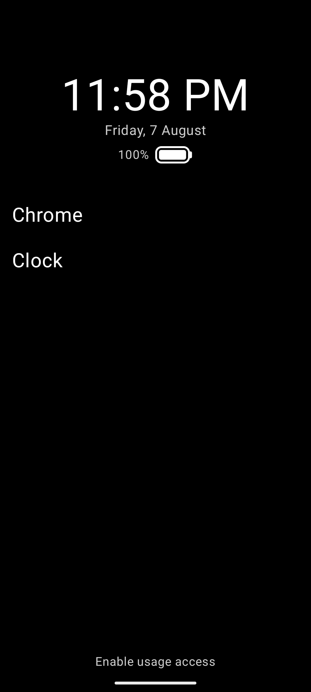
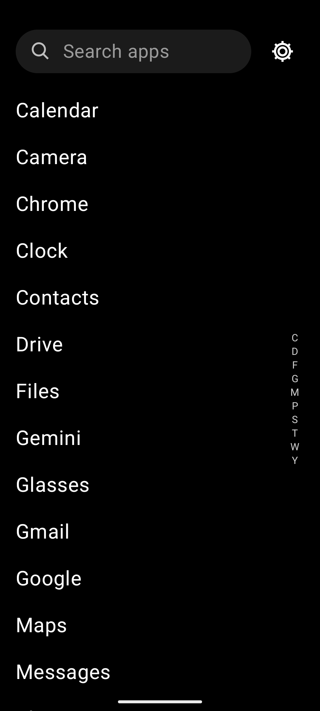
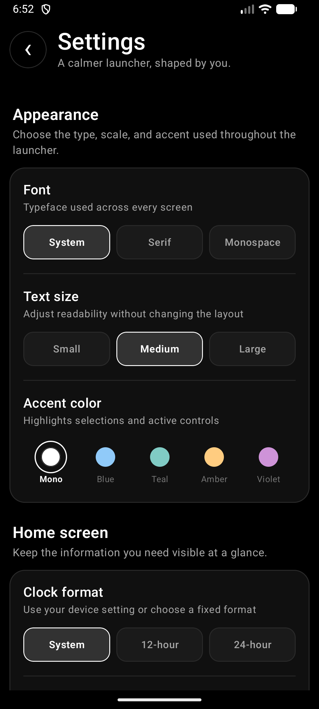

<h1 align="center">Minimal Launcher</h1>

<p align="center">
  <a href="https://rafaelgoulartb.github.io/minimal-launcher/">
    
  </a>
  <a href="https://github.com/RafaelGoulartB/minimal-launcher/actions/workflows/release-android.yml">
    
  </a>
  <a href="https://github.com/RafaelGoulartB/minimal-launcher">
    
  </a>
</p>

> A quiet, text-first Android home screen built with Kotlin and Jetpack Compose.

Minimal Launcher keeps the apps you choose on a calm Home screen and puts the complete searchable app list one swipe away. It is local-first by design: no account, ads, analytics, background service, or internet permission.

<p align="center">
  <a href="https://rafaelgoulartb.github.io/minimal-launcher/">Website</a> ·
  <a href="https://rafaelgoulartb.github.io/minimal-launcher/docs/">Documentation</a> ·
  <a href="https://github.com/RafaelGoulartB/minimal-launcher/releases/latest">Download latest APK</a>
</p>

## Screenshots

<p align="center">
  
  
  
</p>

## What it does

- Keeps selected apps and folders on a text-first Home screen, with drag-to-reorder.
- Opens the full app drawer with a swipe; search and the alphabet rail make long lists quick to navigate.
- Creates folders, renames launcher labels, and lets you hide or block apps from the launcher.
- Lets you choose typeface, text size, accent color, clock format, and which Home details to display.
- Can show battery state and today's on-device screen time when Usage Access is granted.

Blocking only applies inside Minimal Launcher. Hidden and blocked apps stay installed and can be restored from Settings.

## Privacy

Preferences such as Home order, folders, custom labels, and appearance settings are saved locally with Android DataStore. The app has no `INTERNET` permission and does not use analytics or advertising SDKs.

Usage Access is optional and is used only to calculate the current day's foreground-app total for the Home summary. The uninstall action opens Android's own confirmation screen.

See the [privacy and permissions guide](https://rafaelgoulartb.github.io/minimal-launcher/docs/privacy.html) for the complete breakdown.

## Getting started

Requirements: Android 8.0 (API 26) or newer; Android Studio with its bundled JDK, or JDK 17; Android SDK 37.

```sh
make doctor
make debug
```

The debug APK is produced at `app/build/outputs/apk/debug/app-debug.apk`. On Windows, the direct Gradle command is:

```powershell
.\gradlew.bat :app:assembleDebug
```

To install and open the launcher on a selected device:

```sh
make run DEVICE=emulator-5554
```

Press the device Home button and choose **Minimal Launcher**, or use `make home DEVICE=emulator-5554` to open Android's default Home app setting.

## Development

```sh
make check       # Android lint and local unit tests
make unit-test   # Local JVM tests
make ui-test     # Compose tests on a connected device
make release     # Release APK
make bundle      # Release Android App Bundle
```

The app has one activity and a state-driven Compose UI. Platform access and persistence are under [`data/`](app/src/main/java/com/rafael/minimallauncher/data/); screens, appearance, events, and the ViewModel live under [`ui/`](app/src/main/java/com/rafael/minimallauncher/ui/). The [architecture note](docs/architecture.md) covers the state flow and platform boundaries.

## Documentation and website

The static site in [`www/`](www/) is published to GitHub Pages when it changes. Its short documentation section covers [setup](www/docs/getting-started.html), [daily use](www/docs/using-the-launcher.html), and [privacy](www/docs/privacy.html). App and build-system changes on `main` trigger the signed Android release workflow.

## Contributing

Issues and pull requests are welcome. Keep the text-first, local-only approach intact; add JVM coverage for pure logic and Compose tests for UI behavior; and run `make check` before opening a pull request.
